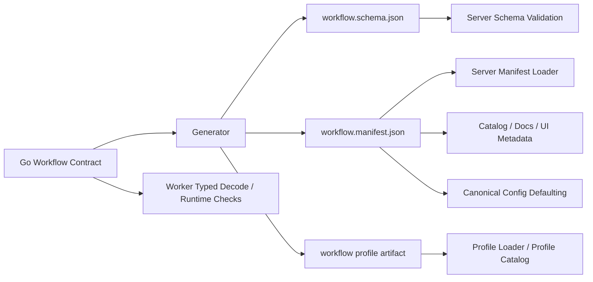

# Workflow Schema / Manifest Separation Design

## Objective

把 workflow 体系中的“配置校验”与“业务描述”做彻底分层：

- `schema`：只负责 JSON Schema 校验与标准注解；
- `manifest`：负责 workflow catalog、stage/tool/parameter 元数据、默认值语义与 canonical 配置归一化所需信息；
- `profile`：继续作为独立 artifact 保存默认 profile 配置，由 manifest 通过 `defaultProfileId` 引用；
- `contract`：继续作为代码侧单一生成源。

这是在“不考虑兼容性，只看未来扩展性”的前提下，更标准的终局方案。

## Why Current Design Is Not Terminal

即使把现有字段命名全面升级为：

- `x-workflow-id`
- `x-stage-id`
- `x-metadata.displayName`

它本质上仍然是把业务元数据塞进 JSON Schema 扩展字段中。问题仍然存在：

1. catalog 和 config validation 依赖同一个工件；
2. defaulting 语义与 schema 注解语义天然纠缠；
3. 每加一种 workflow 描述能力，都倾向继续往 schema 里加自定义字段；
4. schema 失去“可被通用工具直接理解的纯校验工件”属性。

因此，“schema 扩展字段命名统一”是比现在更好，但不是长期 100 分终局。

## Recommended End-State

### Artifact Split

每个 workflow 由至少三类生成工件组成：

1. `subdomain_discovery.schema.json`
   - JSON Schema Draft-07
   - 只做配置结构、类型、范围、枚举、标准 `default` 注解表达

2. `subdomain_discovery.manifest.json`
   - workflow 业务描述与可执行语义清单
   - 被 server catalog、docs、defaulting、runtime 准备阶段消费

3. `profiles/subdomain_discovery.yaml`
   - 默认 profile 配置内容
   - 继续由现有 profile loader / profile catalog 消费

### Contract Pipeline



### Module Boundary

- `worker/internal/workflow/contract_types.go`
  - 定义代码侧单一 contract 模型
- `worker/cmd/workflow-contract-gen/main.go`
  - 从 contract 生成 schema + manifest + profile + docs
- `server/internal/workflow/schema`
  - 只做 config validation
- `server/internal/workflow/manifest`
  - 负责 workflow metadata discovery / catalog loading
- `server/internal/workflow/profile`
  - 继续负责 profile artifact 加载
- `worker/internal/activity/*`
  - 继续负责 activity template metadata，不承担 workflow manifest 职责

## Manifest Contract Shape

建议 manifest 采用 camelCase JSON 字段，并至少包含：

```json
{
  "manifestVersion": 1,
  "workflowId": "subdomain_discovery",
  "displayName": "Subdomain Discovery",
  "description": "Discover all subdomains of target domains...",
  "configSchemaId": "lunafox://schemas/workflows/subdomain_discovery",
  "supportedTargetTypeIds": ["domain"],
  "defaultProfileId": "subdomain_discovery",
  "stages": []
}
```

其中：

- `workflowId` 是唯一稳定机器标识；
- `displayName` 是 UI / docs 展示名；
- `configSchemaId` 把 manifest 与 schema 明确关联；
- `defaultProfileId` 引用独立 profile artifact，而不是内嵌 profile 对象；
- `stages` 内继续嵌套 stage / tool / parameter 元数据；
- 参数默认值与约束语义可在 contract / manifest 中保留为可执行事实源。

## Manifest Validation Strategy

第一阶段就应该钉死，不再留开放口：

- 使用 Go 强类型解码
- 拒绝 unknown fields
- 执行必填字段校验
- 执行 semantic ID 校验
- 执行引用关系校验，例如 `defaultProfileId` 必须能解析到 profile artifact

后续如果需要，再补独立 manifest schema；但那是增强项，不是当前前置条件。

## Model Separation Rule

这里必须明确一条边界：

- `workflow manifest` 不是 `activity template metadata`
- `activity template metadata` 也不是 `workflow manifest`

当前 `/Users/yangyang/Desktop/lunafox/worker/internal/workflow/workflow_metadata.go` 这类结构承载的是 worker 模板相关元数据语义，不能直接拿来当 manifest 模型。

否则会出现：

- 字段命名被两套职责拉扯
- loader 校验规则互相污染
- 一个地方改字段，另一个系统被误伤

因此，终局方案必须要求它们拆成两套独立模型。

## Interaction With Existing Proposals

### `refactor-workflow-id-semantics`

保留：
- ID-first 原则
- `workflowId` 是唯一稳定主键

修改：
- `workflowId` 的事实来源从 schema `x-workflow` 改为 manifest `workflowId`
- 如需数据库列迁移，也必须围绕 manifest `workflowId` 语义落地

### `refactor-workflow-contract-naming`

保留：
- `...ID`
- `...DisplayName`
- `...Key`

删除其终局地位的部分：
- schema 扩展字段命名不再是终局，因为 schema 扩展字段本身将被移除

新增：
- manifest 与 activity-template metadata 的模型分离也纳入命名边界控制

### `add-workflow-config-defaulting`

保留：
- server / worker 默认值归一化一致
- scan create 持久化 canonical workflow YAML

修改：
- 默认值、参数约束、canonical config 语义从 manifest / contract 读取，而不是从 schema 扩展字段或 schema 解析副作用读取

## Alternatives Rejected

### 方案 A：继续用 `x-*`，但统一命名
- 优点：改动小，短期干净。
- 缺点：只是“更整洁地耦合”，不是解耦。

### 方案 B：收口到单一 `x-lunafox` 扩展对象
- 优点：比散落字段更规整。
- 缺点：依然把业务描述放在 schema 内，职责问题没变。

### 方案 C：把默认 profile 内嵌进 manifest
- 优点：manifest 看起来更自包含。
- 缺点：重复 profile 配置内容，破坏现有独立 profile artifact 边界，也让 manifest 变重。

## Implementation Ordering

1. 先新增 manifest 生成，不马上删旧 schema metadata；
2. 明确 `defaultProfileId` 与独立 profile artifact 关系；
3. 新增 server manifest loader，并切 catalog 读取路径；
4. 把 defaulting 改到 manifest / contract；
5. 拆开 manifest 与 activity template metadata 模型；
6. 最后删除 schema 中的 LunaFox 业务扩展字段；
7. 收尾时统一回写命名、ID-first、defaulting 三个提案文档。

## Final Recommendation

如果目标是“以后最标准、扩展性最好”的做法，推荐把 **`schema / manifest / profile 分层`** 作为 workflow 系统的上位架构基线。

命名统一仍然重要，但它应服务于 manifest / contract 体系，而不是继续优化 schema 扩展字段本身。
