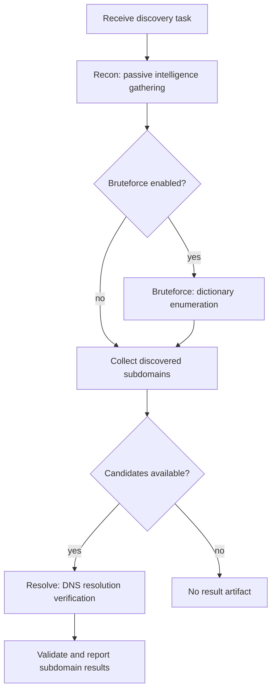

# Subdomain Discovery Engine

This Engine discovers subdomains for a domain target and reports validated
asset-subdomain results through its generated Engine API v2 Facade.

## Engine Runtime Image

`Dockerfile` builds an independent multi-stage `subdomain_discovery` Runtime
Image. It packages the engine binary and its own `subfinder` `v2.12.0`,
PureDNS `v2.1.2-0.20260223162428-46bd4c963ec2` (binary version `v2.1.2`),
and MassDNS `v1.1.0` toolchain. This PureDNS pin includes the upstream
wildcard-root DNS label-boundary fix: `something-p.example.com` is no longer
treated as a child of wildcard root `p.example.com` solely by string suffix.
The fix does not resolve separate shared-answer, CDN, or shared-IP ambiguity.
The `verify`
build stage runs `tests/container/container-conformance.sh` through a transient
read-only BuildKit bind mount; the check requires every executable to be
present on the image `PATH`, verifies the version markers/probes, and confirms
that PureDNS resolves the image-local MassDNS wrapper. The marker-gated final
`runtime` stage does not retain the script or other container-test payload.

The canonical build context is `extensions/engines`, with the repository
`contracts` module supplied as a named BuildKit context:

```sh
docker buildx build \
  --build-arg ENGINE_IMAGE_VERSION=0.0.0-dev \
  --build-context contracts=./contracts \
  --build-context engine-go=./engine-go \
  -f extensions/engines/subdomain_discovery/Dockerfile \
  extensions/engines
```

The image `ENTRYPOINT` starts the generated Engine API v2 Facade and one handler
run. No legacy server entrypoint is built or started.

The runtime stage explicitly keeps the image default user at `0:0` and does not
request engine-specific capabilities. It follows the shared
[`container` contract](../container/README.md) for OCI labels, empty `Cmd`,
bootstrap names, and canonical mount targets.

The Engine root keeps production source and `engine.json` together; its root
`Dockerfile` is the Runtime Image build definition, and `tests/container/`
contains development/release-only image conformance scripts, profiles,
fixtures, and offline stubs. Ordinary Go package tests remain beside the
packages they test.

## Discovery Flow



## Ownership Boundary

The engine owns subdomain-discovery behavior:

- stage ordering and stage-specific enablement
- tool selection and command arguments
- PureDNS wildcard-filter settings
- subdomain file parsing, filtering, and bounded exact deduplication
- mapping parsed subdomains to asset-subdomain result payloads

## PureDNS Wildcard Policy

The `bruteforce.wildcard-filter` and `resolve.wildcard-filter` parameters are
independent stage-level switches and both default to `false`. With the default,
the corresponding PureDNS invocation receives `--skip-wildcard-filter`, so a
candidate is not discarded by PureDNS's wildcard classifier solely because it
matches a wildcard answer pattern. Set a stage's switch to `true` to use
PureDNS filtering; Bruteforce then also uses its `wildcard-probe-count` and
`wildcard-batch` tuning values.

This switch changes only wildcard classification. The required Resolve stage
still runs its normal DNS resolution verification with its own resolver list,
even when wildcard filtering is disabled. The pinned PureDNS label-boundary
fix remains in effect, while shared-IP/CDN ambiguity remains a known limitation
of the classifier.

The generated Facade and its runtimekit adapter own common runtime mechanics:

- Context/credential/UDS bootstrap and signal-derived cancellation
- projection of complete `Execution.Target`, config-resource paths only for enabled sections, eager platform-resource paths, and writable `Execution.Workspace`
- message-only progress plus status-only bounded typed result batches

The handler receives the complete canonical `Execution.Target` object. The
Engine owns scanner process execution inside the image and consumes
`Execution.Config.Bruteforce.Wordlist`,
`Execution.Config.Bruteforce.Resolvers`, `Execution.Config.Resolve.Resolvers`,
and `Execution.PlatformResources.SubfinderProviderConfig` only through the
read-only paths mounted before startup by Agent; it never requests or recreates
resources at runtime. When recon is enabled, Subfinder always receives exactly
one `-pc` argument with the injected path.

The generated Facade requires the two Bruteforce resource paths only when
Bruteforce is enabled, and requires `Resolve.Resolvers` while the required
Resolve section is enabled. Disabled optional sections require their Context
bindings to be absent and retain zero-value typed paths. The handler reads each
path only inside its matching enabled branch. Platform resources remain
unconditional. First-party Facades using this contract must ship before or
atomically with the conditional Server plan contract; rolling back to an older
eager-resource Facade requires rolling back that Server contract too.

`resolve` is the only required inner config section. Its `requiredEnabled`
declaration is limited to keeping that individual section enabled inside an
enabled Workflow Step; it does not describe stage ordering, candidate handling,
or result-quality policy. Server rejects direct configurations that disable it,
while the handler keeps its separate fail-closed `resolve.enabled` check. The
legacy shared `dns` section has no generated binding or runtime fallback: each
PureDNS invocation consumes only its own stage-owned resolver path.

## Runtime Logging Boundary

Engine code should use `Execution.Progress.Report` only for operator-facing
state changes, such as starting a stage or skipping final Resolve because no
discovery candidates were produced. Agent projects those explicit progress
events into task progress logs.

Every enabled stage that emits a `start stage` progress event must also emit one
terminal stage progress event: `complete stage`, `skip stage`, or `fail stage`.
Failures before a process command starts, such as missing wordlists, resolver
preparation errors, input materialization failures, or workspace allocation
errors, should be surfaced as concise `fail stage ... reason=...` progress
events and still use ordinary runtime logs for diagnostic detail.

Engine-owned tool functions allocate output files beneath `Execution.Workspace`
and start image-local processes with the handler context. Agent does not expose
a process/shell capability or own Engine-local artifact paths.

Use ordinary runtime logs such as `log.Printf` for detailed diagnostics that are
useful during debugging but too noisy for task progress, for example candidate
counts and final Resolve input materialization details.

The resolve stage materializes exactly one final result artifact. After that
artifact is parsed and submitted, the engine emits one
`complete result reporting` progress event with source, parsed, submitted, and
aggregated skip-reason counts, including oversized records. It does not include
individual subdomains.

Before typed result submission, normalized final subdomains are globally
deduplicated through a workspace-local, byte-bounded external merge. This keeps
the Engine's memory independent of total result count while retaining the last
canonical source record in deterministic parser order for each DNS name. Server uniqueness remains the
idempotency backstop for retries, not the normal result duplicate filter.

Final-artifact parsing bounds each physical scanner record at 4 MiB. An
oversized record is counted and skipped so later records can still be reported;
an invalid DNS identity remains skipped and is never guessed from another field.

The result-reporting merge implementation is deliberately owned by this Engine;
it does not depend on a cross-Engine deduplication helper. Keep subdomain-
specific discovery and result-reporting decisions in this engine.

PureDNS retains its own wildcard filtering for Bruteforce and final Resolve.
This engine does not run a second wildcard sample, expansion, or threshold
precheck, and it does not invoke DNSGen.
